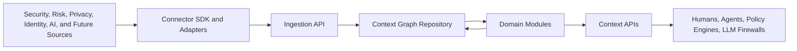

# Architecture

Unified Context Graph is designed as a modular service where domain products
publish normalized facts and consume graph context through stable contracts.

## Layers

### 1. Source and Connector Layer

Adapters translate source-specific records into normalized graph events.
Examples include SIEM alerts, vulnerability findings, IAM events, privacy
records, data catalog entries, LLM gateway traces, model registry metadata, and
agent tool calls.

### 2. Ingestion Layer

The ingestion layer validates normalized events and turns them into graph nodes
and edges. It keeps source provenance and supports idempotent upserts.

### 3. Graph Layer

The graph layer owns:

- ontology enums
- node and edge models
- repository interface
- traversal and context assembly

The initial implementation uses an in-memory repository for local development
and tests. Production backends should implement the same repository protocol.

### 4. Domain Modules

Domain modules add interpretation over the graph:

- **Agentic SOC:** alert, incident, evidence, and response context
- **Risk:** cyber exposure and quantified risk rationale
- **Privacy:** processing purpose, retention, obligations, and controls
- **Policy:** agent and human action authorization
- **LLM firewall:** prompt, response, and tool-call guardrails
- **Identity:** human, service, workload, credential, and agent identity graph
- **Trust DLP:** sensitive data movement, evidence, policy, and control mapping
- **Semantic layer:** stable business vocabulary over graph facts

### 5. API Layer

FastAPI routers expose product capabilities through versioned endpoints.

## Extension Model

New solutions should be added in this order:

1. Add domain-specific node or edge types only if existing ontology concepts do
   not fit.
2. Create adapter code that emits normalized ingestion events.
3. Add domain service logic that consumes graph context.
4. Add tests proving the new facts can be written, traversed, and explained.

## Production Backend Direction

The current repository interface can be backed by:

- Neo4j for graph-native traversal and Cypher analytics
- Postgres for relational consistency and JSON attributes
- OpenSearch or a vector store for semantic retrieval
- Kafka or Redpanda for streaming ingestion and replay

The API layer should not know which backend is active.

## Security Model

The service is structured to support:

- tenant-aware graph records
- request-level identity context
- policy-enforced graph retrieval
- immutable audit events
- source provenance and confidence scoring

Authentication and authorization are not implemented in the initial skeleton but
must be added before external deployment.
